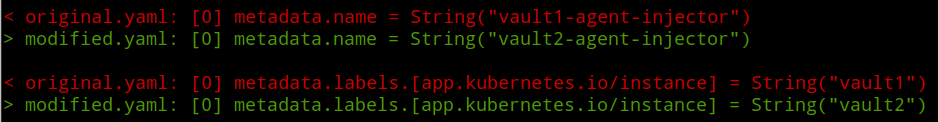
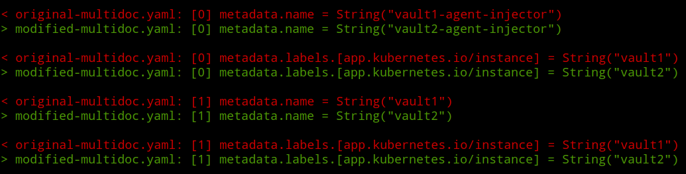
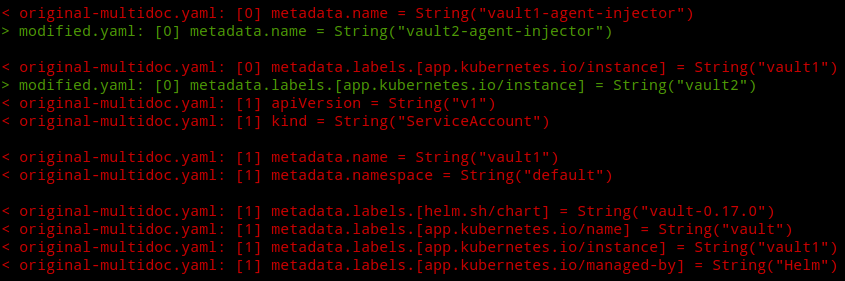
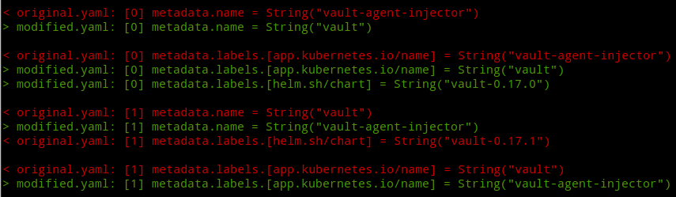
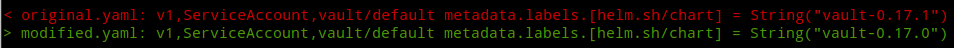
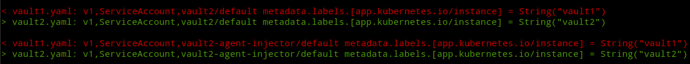

# YAML diff

Compare two YAML files structurally.

## Basic usage

Given two YAML files.

<table>
<tr>
<th> original.yaml </th> <th> modified.yaml </th>
</tr>
<tr>
<td>

```yaml
kind: ServiceAccount
metadata:
  name: vault1-agent-injector
  namespace: default
  labels:
    app.kubernetes.io/name: vault-agent-injector
    app.kubernetes.io/instance: vault1
    app.kubernetes.io/managed-by: Helm
```

</td>
<td>

```yaml
apiVersion: v1
kind: ServiceAccount
metadata:
  name: vault2-agent-injector
  namespace: default
  labels:
    app.kubernetes.io/name: vault-agent-injector
    app.kubernetes.io/instance: vault2
    app.kubernetes.io/managed-by: Helm
```

</td>
</td>
</tr>
</table>

These files can be compared simply with:

```text
yamldiff original.yaml modified.yaml
```

which will show the structural differences:




## Multi document files

The files to be compared can consist of multiple documents.

<table>
<tr>
<th> original-mutlidoc.yaml </th> <th> modified-multidoc.yaml </th>
</tr>
<tr>
<td>

```yaml
---
# Source: vault/templates/injector-serviceaccount.yaml
apiVersion: v1
kind: ServiceAccount
metadata:
  name: vault1-agent-injector
  namespace: default
  labels:
    app.kubernetes.io/name: vault-agent-injector
    app.kubernetes.io/instance: vault1
    app.kubernetes.io/managed-by: Helm
---
# Source: vault/templates/server-serviceaccount.yaml
apiVersion: v1
kind: ServiceAccount
metadata:
  name: vault1
  namespace: default
  labels:
    helm.sh/chart: vault-0.17.0
    app.kubernetes.io/name: vault
    app.kubernetes.io/instance: vault1
    app.kubernetes.io/managed-by: Helm

```

</td>
<td>

```yaml
---
# Source: vault/templates/injector-serviceaccount.yaml
apiVersion: v1
kind: ServiceAccount
metadata:
  name: vault2-agent-injector
  namespace: default
  labels:
    app.kubernetes.io/name: vault-agent-injector
    app.kubernetes.io/instance: vault2
    app.kubernetes.io/managed-by: Helm
---
# Source: vault/templates/server-serviceaccount.yaml
apiVersion: v1
kind: ServiceAccount
metadata:
  name: vault2
  namespace: default
  labels:
    helm.sh/chart: vault-0.17.0
    app.kubernetes.io/name: vault
    app.kubernetes.io/instance: vault2
    app.kubernetes.io/managed-by: Helm

```

</td>
</td>
</tr>
</table>

The documents are compared by matching them one-to-one positionally. The document index is shown in the difference output.

```text
yamldiff original-multidoc.yaml modified-multidoc.yaml
```



If any of the documents in either file cannot be matched, for example if there is an unequal number of documents between the two files, the difference is shown as deletions or insertions in the output.

```text
yamldiff original-multidoc.yaml modified.yaml
```


### Kubernetes YAML files

When comparing Kubernetes YAML files consisting of multiple documents, the documents can be matched by group, version, kind, name and namespace, rather than just position in the file, by specifying the `-k` (or `--k8s`) flag.

Consider the following two Kubernetes YAML files, which have their documents in opposite orders:

<table>
<tr>
<th> original.yaml </th> <th> modified.yaml </th>
</tr>
<tr>
<td>

```yaml
---
# Source: vault/templates/server-serviceaccount.yaml
apiVersion: v1
kind: ServiceAccount
metadata:
  name: vault
  namespace: default
  labels:
    helm.sh/chart: vault-0.17.0
    app.kubernetes.io/name: vault
    app.kubernetes.io/instance: vault
    app.kubernetes.io/managed-by: Helm
---
# Source: vault/templates/injector-serviceaccount.yaml
apiVersion: v1
kind: ServiceAccount
metadata:
  name: vault-agent-injector
  namespace: default
  labels:
    app.kubernetes.io/name: vault-agent-injector
    app.kubernetes.io/instance: vault
    app.kubernetes.io/managed-by: Helm
```

</td>
<td>

```yaml
---
# Source: vault/templates/injector-serviceaccount.yaml
apiVersion: v1
kind: ServiceAccount
metadata:
  name: vault-agent-injector
  namespace: default
  labels:
    app.kubernetes.io/name: vault-agent-injector
    app.kubernetes.io/instance: vault
    app.kubernetes.io/managed-by: Helm
---
# Source: vault/templates/server-serviceaccount.yaml
apiVersion: v1
kind: ServiceAccount
metadata:
  name: vault
  namespace: default
  labels:
    helm.sh/chart: vault-0.17.1
    app.kubernetes.io/name: vault
    app.kubernetes.io/instance: vault
    app.kubernetes.io/managed-by: Helm

```

</td>
</td>
</tr>
</table>

A standard diff will compare the documents in the order they appear, producing apparently several differences.

```bash
yamldiff original.yaml modified.yaml
```



However adding the `-k` flag will match documents by Kubernetes resource type, name and namespace, providing us with a more representative picture.

```bash
yamldiff -k original.yaml modified.yaml
```



### Strategy files

Sometimes, in order to understand the differences between files, it is useful to be able to perform some transformations on the input files prior to comparison. For example, consider to the following two files.

<table>
<tr>
<th> vault1.yaml </th> <th> vault2.yaml </th>
</tr>
<tr>
<td>

```yaml
---
# Source: vault/templates/server-serviceaccount.yaml
apiVersion: v1
kind: ServiceAccount
metadata:
  name: vault1
  namespace: default
  labels:
    helm.sh/chart: vault-0.17.0
    app.kubernetes.io/name: vault
    app.kubernetes.io/instance: vault1
    app.kubernetes.io/managed-by: Helm
---
# Source: vault/templates/injector-serviceaccount.yaml
apiVersion: v1
kind: ServiceAccount
metadata:
  name: vault1-agent-injector
  namespace: default
  labels:
    app.kubernetes.io/name: vault-agent-injector
    app.kubernetes.io/instance: vault1
    app.kubernetes.io/managed-by: Helm
```

</td>
<td>

```yaml
---
# Source: vault/templates/injector-serviceaccount.yaml
apiVersion: v1
kind: ServiceAccount
metadata:
  name: vault2-agent-injector
  namespace: default
  labels:
    app.kubernetes.io/name: vault-agent-injector
    app.kubernetes.io/instance: vault2
    app.kubernetes.io/managed-by: Helm
---
# Source: vault/templates/server-serviceaccount.yaml
apiVersion: v1
kind: ServiceAccount
metadata:
  name: vault2
  namespace: default
  labels:
    helm.sh/chart: vault-0.17.0
    app.kubernetes.io/name: vault
    app.kubernetes.io/instance: vault2
    app.kubernetes.io/managed-by: Helm
```

</td>
</td>
</tr>
</table>

Comparing these files naively shows them to be quite different.

```bash
$ yamldiff --count vault1.yaml vault2.yaml
8 differences (additions: 1, removals: 1, changes: 6)
```
This is because the resource types don't match positionally. So lets add the `--k8s` flag to try to match by resource type.

```bash
$ yamldiff --count --k8s vault1.yaml vault2.yaml
34 differences (additions: 17, removals: 17)
```

This is even worse! Virtually every property now appears to be different. This is because the resource documents can't be matched, since they are named differently ("vault1" naming as compared with "vault2).

It's possible to do some transforms on the inputs before they are matched. This allows you to work around such systemic differences to get a better picture by compensating for known differences and see what remains. The way to do this is to create a strategy file. Here is an example to deal with this case.

```yaml
transform:
  original:
    - select:
        - path: kind
          regex: .+
      replace:
        - path: metadata.name
          regex: vault1
          with: vault2
```

Assuming this is saved in a file named `strat.yaml`, you can instruct `yamldiff` to apply it's rules by specifying a `-f` (or `--strategy`) option:

```bash
yamldiff --k8s -f strat.yaml vault1.yaml vault2.yaml
```



Now we are comparing like-for-like resources, and can more clearly see the differences.

